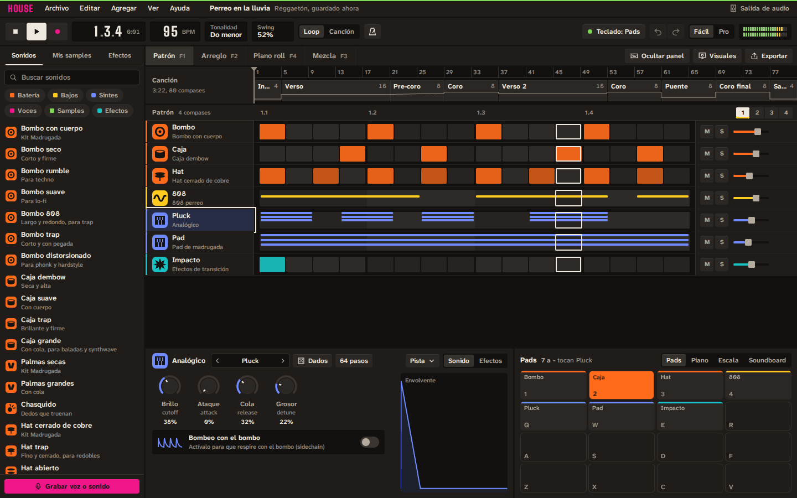
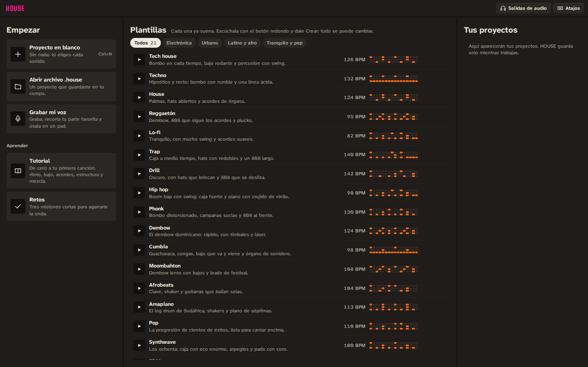
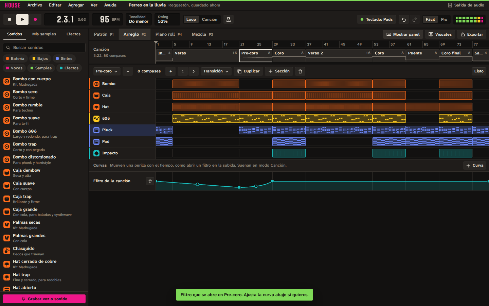
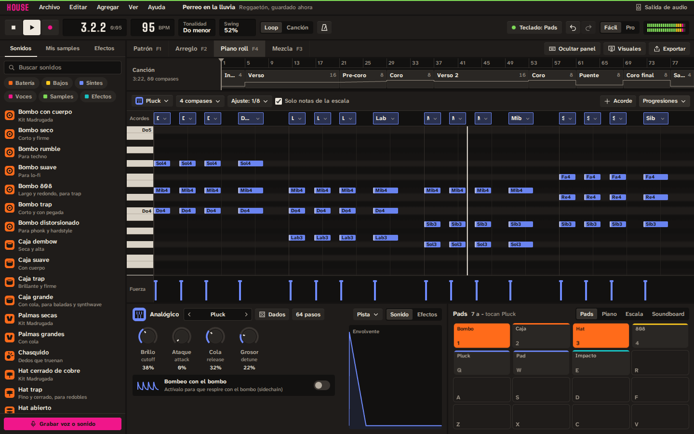
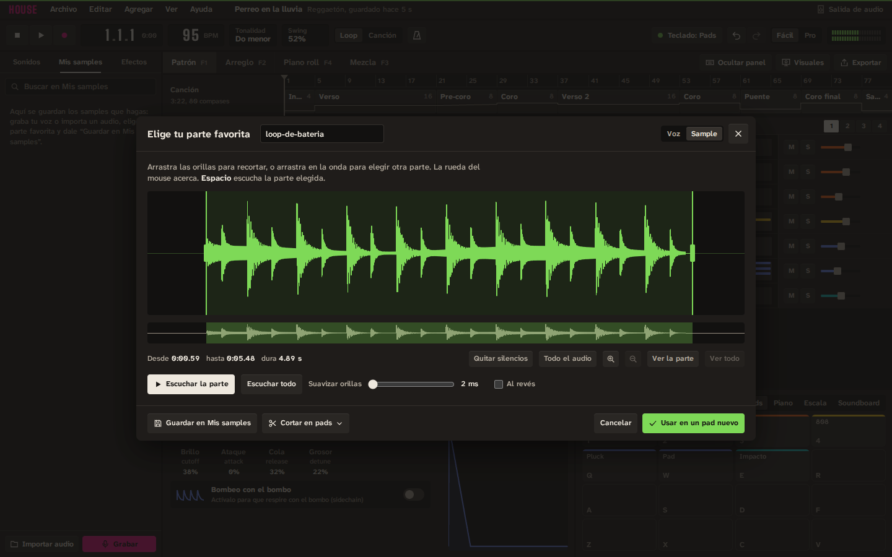
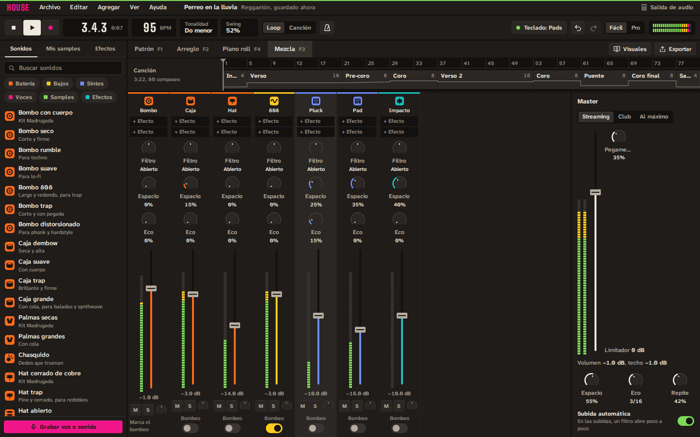
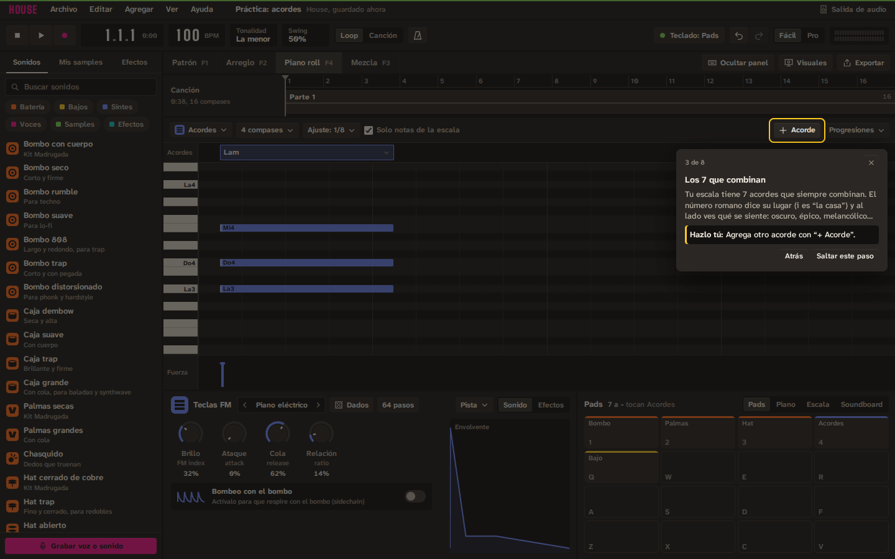

# HOUSE

**Haz el beat, mézclalo y míralo.** HOUSE (nombre clave) es una app de
escritorio para crear música electrónica, urbana y latina (tech house,
techno, reggaetón, trap, cumbia, afrobeats y más), mezclar tus propios tracks
como DJ con audífonos y bocina por separado, grabar tu voz y proyectar
visuales psicodélicos o relajantes en un segundo monitor. Está pensada para que alguien que nunca ha hecho música
tenga su primer beat sonando en cinco minutos, sin quedarse corta cuando ya
sepa lo que hace.

Este repositorio contiene **el plan completo** (visión, investigación,
funciones, diseño, arquitectura, hoja de ruta e ideas) y **la app funcionando**:
el motor de audio en Rust, la interfaz en React y la app de escritorio con
Tauri. El estado exacto está en
[6.9 Estado](docs/06-hoja-de-ruta.md#69-estado-septiembre-de-2026).



## Pruébala

- **En el navegador** (Chrome o Edge recomendados): cada build de CI deja el
  archivo `house-demo-web` (un solo `index.html`) en los artefactos de GitHub
  Actions. Ábrelo, crea un proyecto desde una plantilla y presiona Espacio. En el navegador suena
  por una sola salida; la bocina y los audífonos por separado necesitan la app
  de escritorio.
- **App de escritorio**: los instaladores de Windows, macOS y Linux salen en
  los artefactos `house-Windows`, `house-macOS` y `house-Linux` del mismo
  flujo. Todavía no están firmados: tu sistema te va a pedir confirmación la
  primera vez.

## Cómo se usa

1. En **Inicio** empieza un **proyecto en blanco**, crea uno desde una de las
   21 **plantillas** (escúchalas con el botón redondo) o abre el **Tutorial**:
   11 lecciones que te señalan cada control y te enseñan a hacer música desde
   cero.
2. **Espacio** reproduce o para. Las teclas `1 2 3 4`, `Q W E R`, `A S D F`,
   `Z X C V` tocan tus pistas; `7` a `-` tocan notas del bajo o sinte elegido,
   siempre en la escala. **Tab** prende o apaga el teclado musical. En modo
   **Soundboard** cada tecla de letras y números dispara el sonido que le
   pongas, aunque la canción esté parada: clic en una tecla vacía para darle
   sonido, clic derecho para cambiarlo.
3. Arrastra sonidos del **navegador** a las pistas. En **Patrón** (F1) haz
   clic en los pasos para prender golpes; en **Piano roll** (F4) dibuja notas
   y pon **acordes** con la tira de arriba o con "Progresiones".
4. En **Arreglo** (F2) decide qué suena en cada parte de la canción y ponle
   **transiciones**: curvas que abren un filtro o hacen crecer el eco. Haz
   clic o arrastra en la regla de la **línea de tiempo** para ir a cualquier
   punto.
5. **Graba tu voz** (Ctrl+R) o suelta un audio: el editor te deja elegir tu
   parte favorita, cortarla en pads y guardarla en **Mis samples**.
6. En **Mezcla** (F3) ajusta volúmenes y agrega **efectos** a cada pista.
   **Exportar** crea un WAV; **Visuales** (F6) abre la ventana para el
   segundo monitor.
7. Todo se guarda solo. **Ctrl+Z** deshace.

## Cómo se compila

Necesitas Rust (estable, con el target `wasm32-unknown-unknown`) y Node 22.

```bash
# Motor de audio: pruebas y versión WebAssembly para la interfaz
cargo test --workspace --release
bash scripts/build-wasm.sh

# Interfaz en el navegador (http://localhost:5173)
npm --prefix app install
npm --prefix app run dev

# App de escritorio (en Linux instala antes las dependencias de Tauri 2)
npm install
npm run desktop          # desarrollo
npm run desktop:build    # instalador

# Pruebas de la interfaz en un navegador real
npm --prefix app run build
npm --prefix app run test:e2e

# Demo en un solo archivo HTML (app/dist-demo/index.html)
npm --prefix app run build:demo
```

| Carpeta | Qué hay |
|---|---|
| `crates/house-engine` | Motor de audio en Rust: batería sintetizada, Ácido, 808, Analógico, Teclas FM, Supersaw, Cuerdas, Sampler con recorte, secuenciador, secciones, curvas de automatización, efectos por pista y master. El mismo código corre como WebAssembly y nativo. |
| `app/` | Interfaz en React 19 + TypeScript: Inicio, Estudio (Patrón, Arreglo, Piano roll y Mezcla), editor de audio, tutorial, Visuales, diálogos, pruebas de punta a punta. |
| `src-tauri/` | App de escritorio: ventanas, audio nativo con `cpal`, dos salidas con compensación de deriva, guardar archivos. |
| `scripts/` | Compilar el motor a WebAssembly y revisar licencias de npm. |

## El plan

| # | Documento | Qué tiene |
|---|---|---|
| 1 | [Visión y producto](docs/01-vision.md) | Para quién es, principios, espacios de la app, recorridos clave, nombre. |
| 2 | [Investigación](docs/02-investigacion.md) | Qué hacen las apps de música en 2026, hallazgos técnicos que cambian el plan, la receta de cada género (BPM, patrones, estructuras), fuentes. |
| 3 | [Funciones](docs/03-funciones.md) | Especificación módulo por módulo: estudio, sintetizadores, teclado como pads, sampling, voz, efectos, mezcla, cabina DJ, salidas de audio, visuales, aprendizaje. |
| 4 | [Diseño de interfaz](docs/04-diseno.md) | La dirección visual ("Estudio", antes "Sonidero"), por qué se ve así y cómo no caer en lo genérico. |
| 5 | [Arquitectura](docs/05-arquitectura.md) | Tecnología elegida, motor de audio, multi-salida, visuales, IA local, librerías y licencias. |
| 6 | [Hoja de ruta](docs/06-hoja-de-ruta.md) | Fases con entregables y criterios de salida, riesgos, métricas y decisiones pendientes. |
| 7 | [Ideas](docs/07-ideas.md) | Banco de ideas para que HOUSE tenga cosas que nadie más tiene. |

Además: [`DESIGN.md`](DESIGN.md) (el contrato visual), [`diseno/`](diseno/)
(bocetos y capturas) y [`CLAUDE.md`](CLAUDE.md) (contexto para sesiones de
IA).

## Lo esencial en una tabla

| Módulo | Qué hace | Fase |
|---|---|---|
| **Estudio** | Patrones por pasos, canción con secciones (intro, subida, drop…), piano roll, "De loop a canción". | 1–2 |
| **Instrumentos** | Máquina de ritmos, Ácido, 808, Analógico, Ondas (wavetable), Sampler, Nubes (granular), Teclas, Voces; FM y modelado físico después. | 1–5 |
| **Teclado musical** | Tu teclado como 32 pads, piano, escala sin notas equivocadas, acordes con un dedo, lanzador y efectos en vivo. | 1–2 |
| **Sampling** | Arrastrar audio, cortar, ajustar al tempo y al tono, remuestrear, separar stems con IA local. | 1–5 |
| **Voz** | Asistente de micrófono, monitoreo con baja latencia, tomas, afinación, quitar ruido, letra. | 2 |
| **Mezcla** | Mezclador con bombeo en un clic, asistentes, medidores LUFS, master en un clic. | 1–2 |
| **Cabina DJ** | Tus proyectos llegan solos con stems perfectos; dos decks, sync, pre-escucha en audífonos y master en bocina, aunque sean aparatos distintos. | 4 |
| **Visuales** | Ventana aparte para el monitor 2; escenas psicodélicas y relajantes que saben cuándo viene el drop; modo seguro; video vertical. | 3 |

## Decisiones clave

- **App de escritorio** (Windows y macOS primero): hace falta latencia baja,
  varias salidas de audio a la vez y una segunda pantalla.
- **Tauri 2 + motor de audio nativo en Rust + interfaz en React/TypeScript +
  visuales WebGL2/WebGPU** en una ventana aparte.
- **Diseño "Estudio"**: un estudio de producción serio (menús, línea de
  tiempo, arreglo, piano roll, mezcla) con la identidad de HOUSE en los
  detalles: tintas por familia de sonido, pictogramas estilo Metro, Big
  Shoulders + Atkinson Hyperlegible Next. Nada de degradados morados ni
  tarjetas genéricas.
- **La IA ayuda, no compone por ti**: stems, limpieza de voz, análisis y un
  copiloto opcional.

## Capturas y bocetos

| | |
|---|---|
|  |  |
|  |  |
|  |  |

Bocetos de lo que viene (Cabina DJ, Voz):

| | |
|---|---|
|  |  |

Detalle de cada pantalla en [`diseno/README.md`](diseno/README.md).

## Siguientes pasos

1. Decidir lo que está en
   [6.7 Decisiones que te tocan a ti](docs/06-hoja-de-ruta.md#67-decisiones-que-te-tocan-a-ti)
   (nombre, plataforma, código abierto o cerrado, tu equipo de audio). La
   licencia del código queda sin elegir hasta entonces.
2. Medir en equipo real lo que el contenedor no puede: latencia tecla ›
   sonido, dos salidas durante 30 minutos y 60 fps en el monitor 2.
3. Probar la Fase 1 con 5 a 10 personas que nunca han hecho música.
