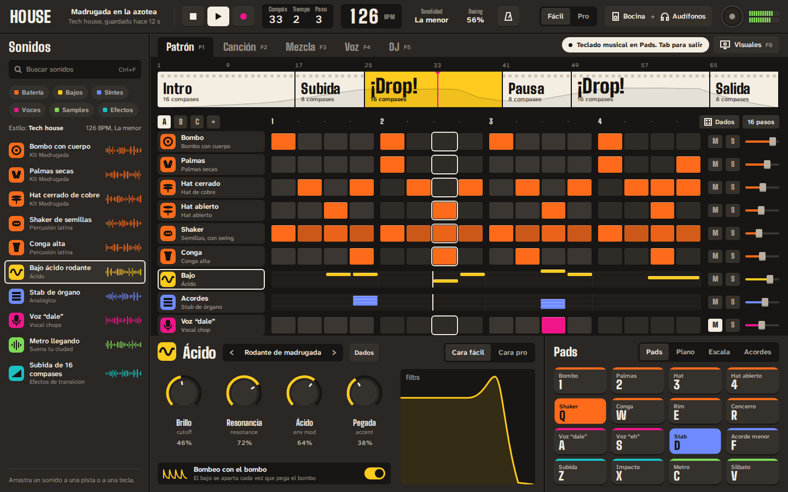
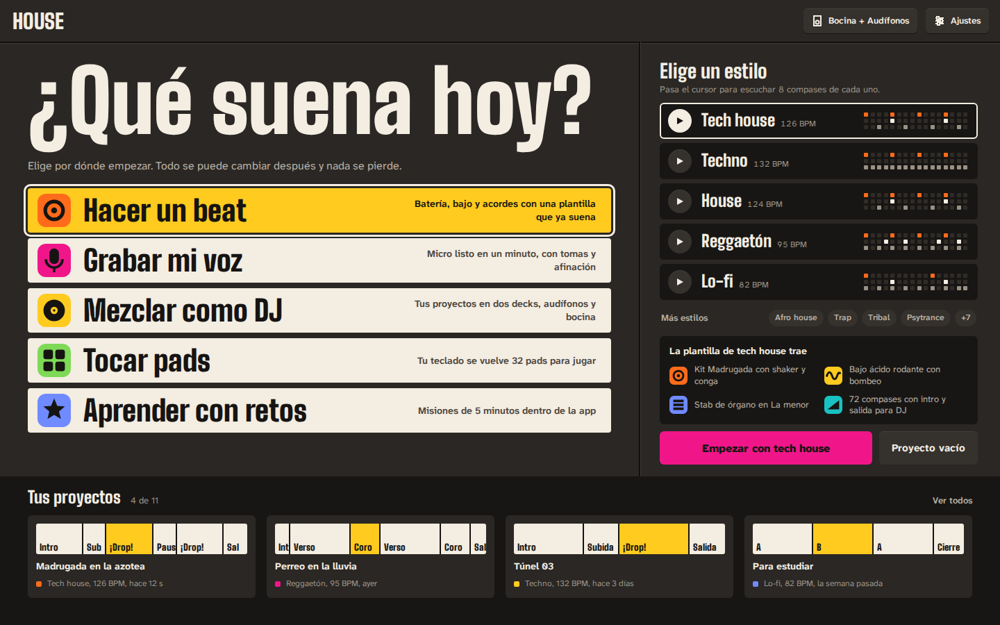
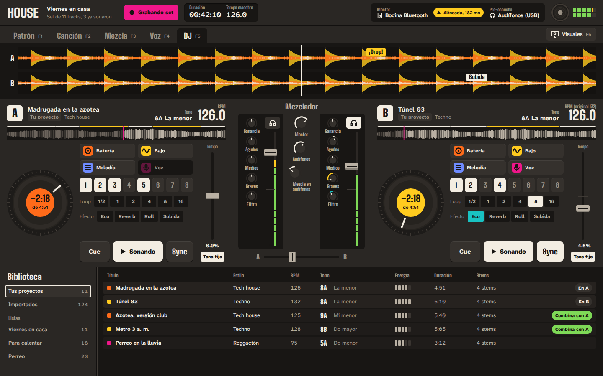
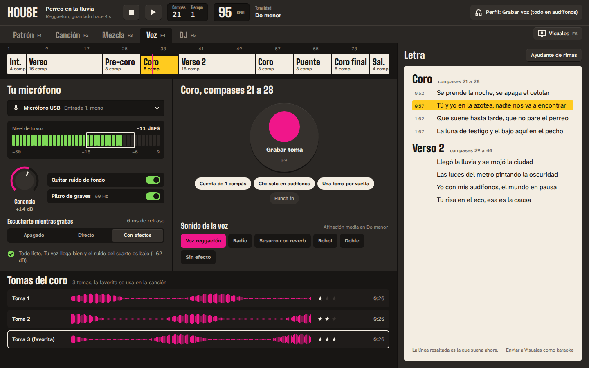
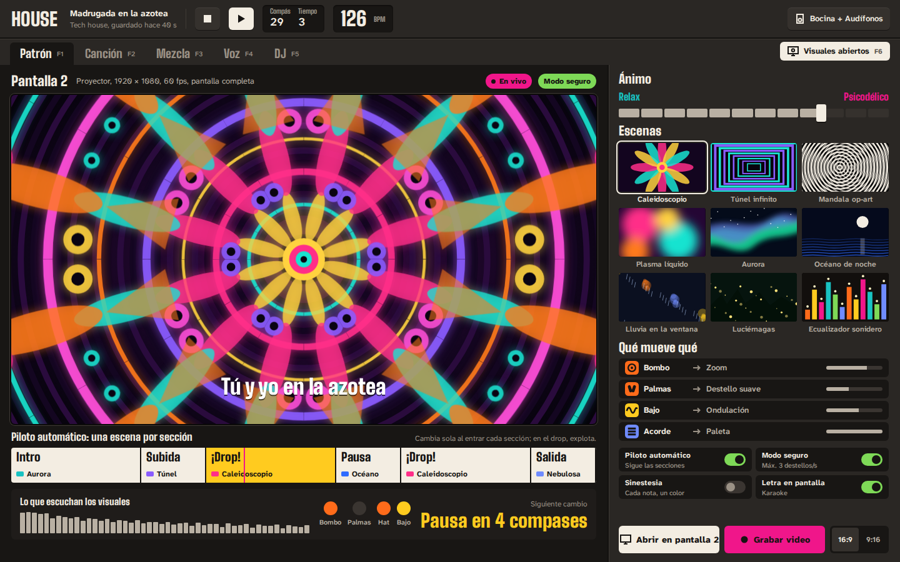

# HOUSE

**Haz el beat, mézclalo y míralo.** HOUSE (nombre clave) es una app de
escritorio para crear música electrónica y urbana (tech house, techno,
reggaetón y más), mezclar tus propios tracks como DJ con audífonos y bocina
por separado, grabar tu voz y proyectar visuales psicodélicos o relajantes en
un segundo monitor. Está pensada para que alguien que nunca ha hecho música
tenga su primer beat sonando en cinco minutos, sin quedarse corta cuando ya
sepa lo que hace.

Este repositorio contiene **el plan completo**: visión, investigación,
funciones, diseño de interfaz, arquitectura, hoja de ruta e ideas, además de
los bocetos de las pantallas principales.

## El plan

| # | Documento | Qué tiene |
|---|---|---|
| 1 | [Visión y producto](docs/01-vision.md) | Para quién es, principios, espacios de la app, recorridos clave, nombre. |
| 2 | [Investigación](docs/02-investigacion.md) | Qué hacen las apps de música en 2026, hallazgos técnicos que cambian el plan, la receta de cada género (BPM, patrones, estructuras), fuentes. |
| 3 | [Funciones](docs/03-funciones.md) | Especificación módulo por módulo: estudio, sintetizadores, teclado como pads, sampling, voz, efectos, mezcla, cabina DJ, salidas de audio, visuales, aprendizaje. |
| 4 | [Diseño de interfaz](docs/04-diseno.md) | La dirección visual "Sonidero", por qué se ve así y cómo no caer en lo genérico. |
| 5 | [Arquitectura](docs/05-arquitectura.md) | Tecnología elegida, motor de audio, multi-salida, visuales, IA local, librerías y licencias. |
| 6 | [Hoja de ruta](docs/06-hoja-de-ruta.md) | Fases con entregables y criterios de salida, riesgos, métricas y decisiones pendientes. |
| 7 | [Ideas](docs/07-ideas.md) | Banco de ideas para que HOUSE tenga cosas que nadie más tiene. |

Además: [`DESIGN.md`](DESIGN.md) (el contrato visual), [`diseno/`](diseno/)
(bocetos y capturas) y [`CLAUDE.md`](CLAUDE.md) (contexto para sesiones de
IA).

## Lo esencial en una tabla

| Módulo | Qué hace | Fase |
|---|---|---|
| **Estudio** | Patrones por pasos, canción con secciones (intro, subida, drop…), piano roll, "De loop a canción". | 1–2 |
| **Instrumentos** | Máquina de ritmos, Ácido, 808, Analógico, Ondas (wavetable), Sampler, Nubes (granular), Teclas, Voces; FM y modelado físico después. | 1–5 |
| **Teclado musical** | Tu teclado como 32 pads, piano, escala sin notas equivocadas, acordes con un dedo, lanzador y efectos en vivo. | 1–2 |
| **Sampling** | Arrastrar audio, cortar, ajustar al tempo y al tono, remuestrear, separar stems con IA local. | 1–5 |
| **Voz** | Asistente de micrófono, monitoreo con baja latencia, tomas, afinación, quitar ruido, letra. | 2 |
| **Mezcla** | Mezclador con bombeo en un clic, asistentes, medidores LUFS, master en un clic. | 1–2 |
| **Cabina DJ** | Tus proyectos llegan solos con stems perfectos; dos decks, sync, pre-escucha en audífonos y master en bocina, aunque sean aparatos distintos. | 4 |
| **Visuales** | Ventana aparte para el monitor 2; escenas psicodélicas y relajantes que saben cuándo viene el drop; modo seguro; video vertical. | 3 |

## Decisiones clave

- **App de escritorio** (Windows y macOS primero): hace falta latencia baja,
  varias salidas de audio a la vez y una segunda pantalla.
- **Tauri 2 + motor de audio nativo en Rust + interfaz en React/TypeScript +
  visuales WebGL2/WebGPU** en una ventana aparte.
- **Diseño "Sonidero"**: chasis de aparato, tintas de cartel sonidero con
  texto negro, Big Shoulders + Atkinson Hyperlegible Next. Nada de
  degradados morados ni tarjetas genéricas.
- **La IA ayuda, no compone por ti**: stems, limpieza de voz, análisis y un
  copiloto opcional.

## Bocetos

| | |
|---|---|
|  |  |
|  |  |

Detalle de cada pantalla en [`diseno/README.md`](diseno/README.md).

## Siguientes pasos

1. Revisar el plan y los bocetos; decidir lo que está en
   [6.7 Decisiones que te tocan a ti](docs/06-hoja-de-ruta.md#67-decisiones-que-te-tocan-a-ti)
   (nombre, plataforma, código abierto o cerrado, tu equipo de audio).
2. Arrancar la **Fase 0**: las cuatro pruebas técnicas (tecla › sonido en
   menos de 10 ms, dos salidas sincronizadas, visuales en el monitor 2, voz
   alineada) y el catálogo de componentes del sistema de diseño.
